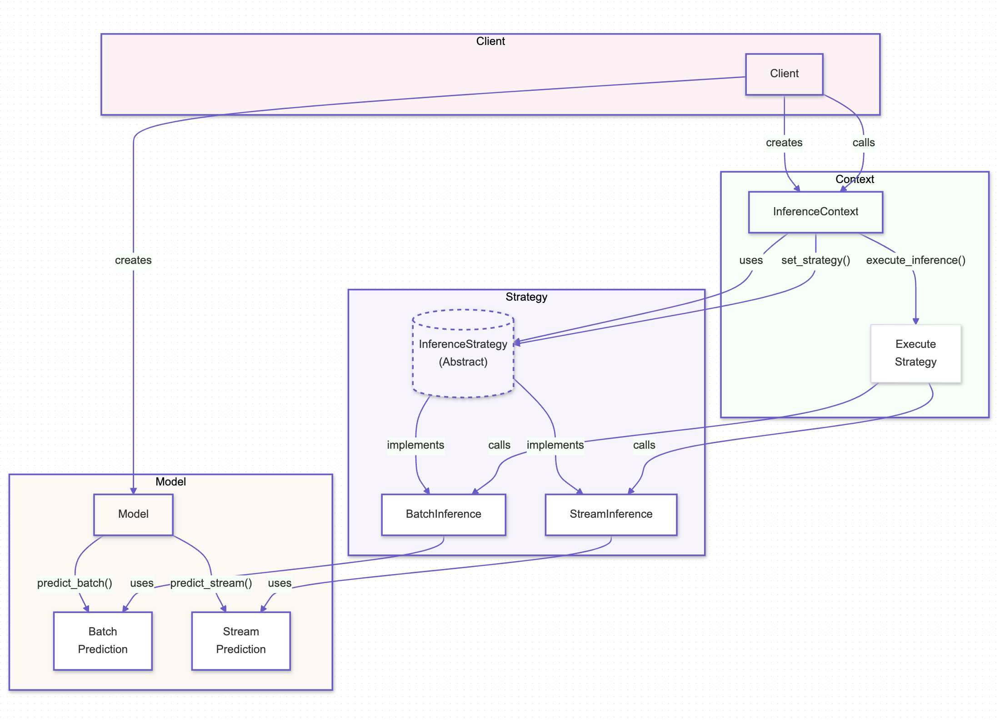
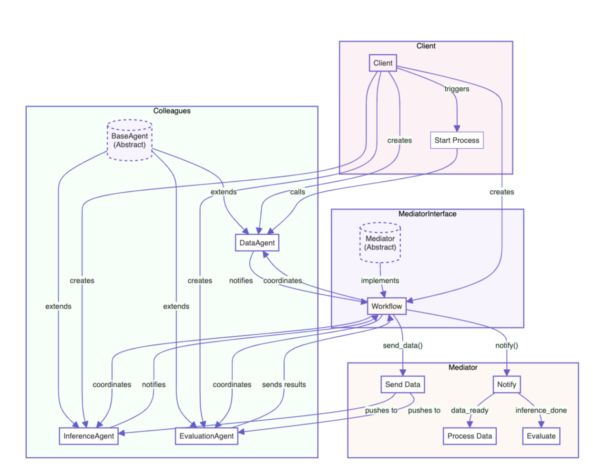
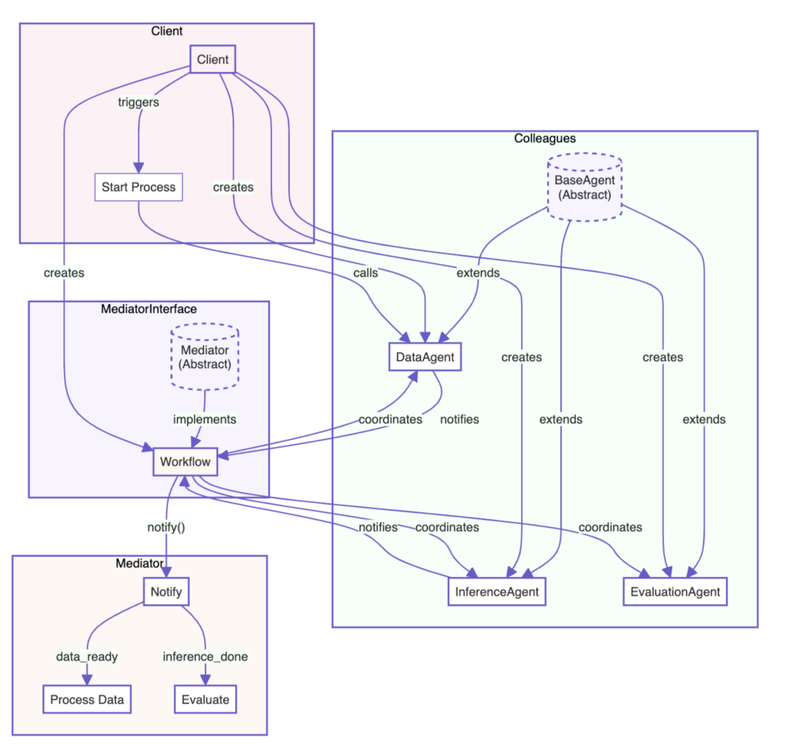
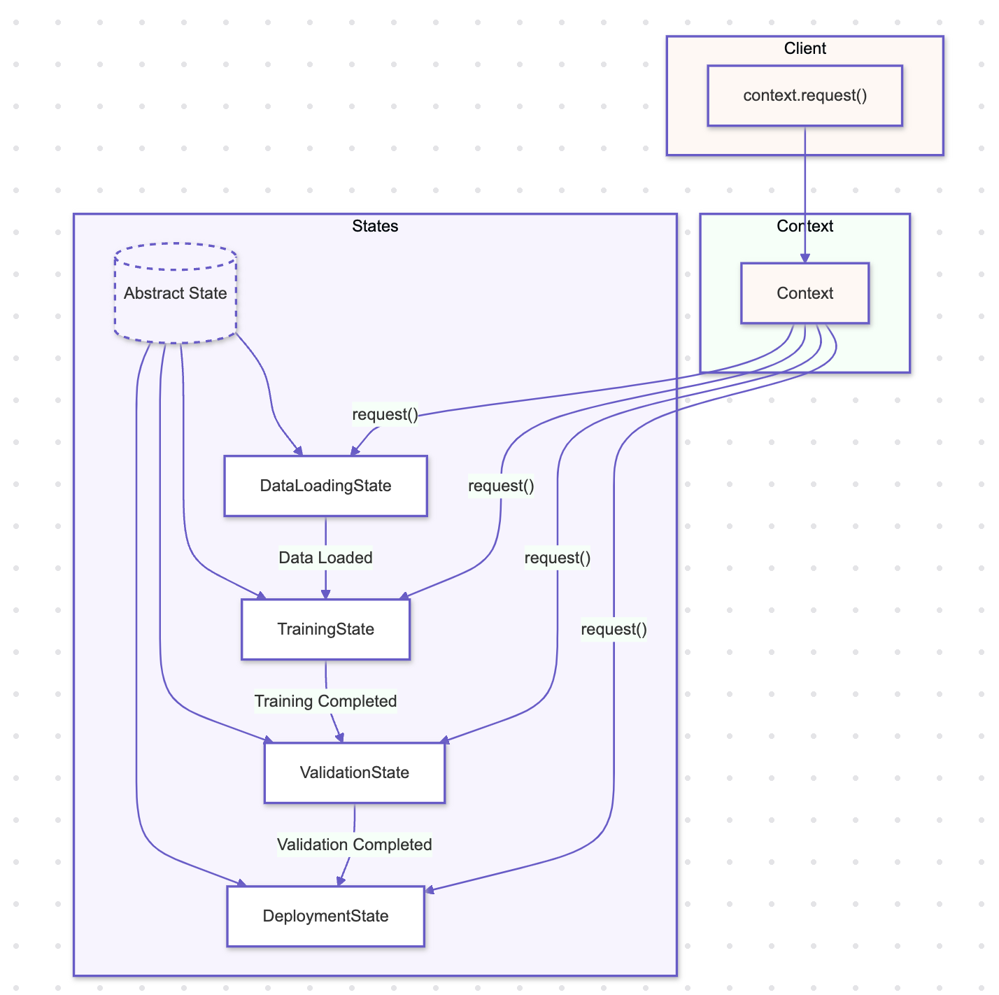

# Python Design Patterns for AI

A repository showcasing Python design patterns specifically adapted for building robust and efficient AI workflows. This collection serves as a practical guide to leveraging design patterns in AI development, providing clear, well-documented examples to help you build scalable and maintainable systems.


## Overview

Design patterns are reusable solutions to common software design problems. In AI development, they are invaluable for structuring code, promoting reusability, and simplifying the management of complex systems. By applying the right design patterns, you can enhance the flexibility, scalability, and maintainability of your AI workflows.

### Why Use Design Patterns in AI?

- **Scalability:** Design patterns help manage the complexities of scaling AI systems, ensuring that your code can handle increasing loads and additional features without becoming unwieldy.
- **Reusability:** By following established patterns, you can create components that are easy to reuse across different parts of your AI projects or even across different projects entirely.
- **Maintainability:** Design patterns encourage the creation of clear, modular code, making it easier to understand, modify, and extend your AI systems over time.
- **Efficiency:** Certain patterns are specifically designed to optimize resource usage, which is crucial in AI systems where computational power and memory are often limiting factors.

## Running the Examples

To run the examples provided in this repository, follow these steps:

```bash
$ git clone https://github.com/arunpshankar/Python-Design-Patterns-for-AI.git
$ cd Python-Design-Patterns-for-AI

$ export PYTHONPATH=$PYTHONPATH:.

# Run the Singleton pattern example
$ python src/patterns/01_singleton/example_01.py 
```

## Key Design Patterns for AI

### 1. Singleton Pattern

#### Overview

The Singleton Pattern ensures that a class has only one instance and provides a global point of access to that instance. This is particularly useful in AI systems where a single instance of a resource or manager is required to coordinate actions across the system, such as managing shared models, configuration settings, or access to computational resources.

#### Benefits

- **Controlled Access to Shared Resources:** In AI systems, Singleton can be used to manage access to shared resources like pre-trained models, ensuring consistent behavior and avoiding the overhead of loading models multiple times.
- **Efficient Resource Management:** By limiting instances, the Singleton pattern helps in managing computational resources efficiently, which is critical in AI environments where GPU memory and CPU cycles are precious.
- **Global Access:** Singleton provides a global access point to key AI components, such as a model inference engine or a data pipeline manager, ensuring that they can be easily utilized across various modules of the application.

#### Use Cases

- **Model Management:** A Singleton can manage the lifecycle of AI models, ensuring that only one instance of a model is loaded into memory, reducing the overhead associated with loading and unloading large models.
- **Inference Engine:** A Singleton inference engine can serve as a central point for handling predictions, ensuring consistency and reducing the risk of loading multiple instances of the same model.
- **Configuration Management:** AI systems often require consistent configuration across different components, and a Singleton can ensure that these settings are centrally managed and globally accessible.
- **Resource Pooling:** Singleton can manage pools of resources like GPU clusters, ensuring that the resources are optimally used without the risk of over-provisioning or under-utilization.

#### Pattern Illustration

<div align="center">
  
</div>

---

### 2. Factory Pattern

## Overview

The Factory Pattern is a creational design pattern that provides an interface for creating objects in a super class but allows subclasses to alter the type of objects that will be created. This pattern is particularly useful in AI systems where object creation is complex or requires extensive setup, such as configuring different types of models or processing pipelines.

## Benefits

- **Decoupled Object Creation:** The Factory Pattern decouples the object creation process from the code that uses the objects, leading to cleaner, more maintainable code in AI systems where models or components may change frequently.
- **Enhanced Flexibility:** By centralizing the creation logic, the Factory Pattern allows easy swapping or upgrading of AI models, data processors, or other components without modifying the existing codebase.
- **Reusability:** The pattern encourages reusability by providing a standard way to create objects, which can be reused across different parts of an AI system, reducing redundancy and potential errors.

## Use Cases

- **Model Instantiation:** A Factory can be used to instantiate different types of AI models based on the input parameters, allowing for flexible deployment of models tailored to specific tasks.
- **Data Pipeline Creation:** The Factory Pattern can manage the creation of different data processing pipelines, ensuring that the correct series of processors is applied based on the type of input data.
- **Algorithm Selection:** In scenarios where multiple algorithms are available, a Factory can select and instantiate the most appropriate algorithm based on the context, such as choosing between different optimization techniques or learning models.

## Pattern Illustration

<div align="center">
  
</div>

---

### 3. Observer Pattern

## Overview

The Observer Pattern is a behavioral design pattern that allows an object, known as the subject, to maintain a list of its dependents, called observers, and notify them automatically of any state changes, usually by calling one of their methods. This pattern is particularly useful in AI systems where multiple components need to be updated or informed of changes in state, such as model updates, data changes, or system status.

## Benefits

- **Decoupled Communication:** The Observer Pattern promotes loose coupling between the subject and observers, enabling AI components to interact without being tightly integrated, making the system more modular and easier to maintain.
- **Real-Time Updates:** This pattern is ideal for scenarios where real-time updates are crucial, such as in AI monitoring systems, where changes in input data or model performance need to be propagated instantly across various parts of the system.
- **Scalability:** The Observer Pattern allows adding new observers without modifying the subject, enhancing the scalability of AI systems that may require monitoring or interacting with various components dynamically.

## Use Cases

- **Model Monitoring:** The Observer Pattern can be used to monitor AI model performance, where different monitoring tools (observers) are notified of changes in model metrics, triggering alerts or adjustments.
- **State Synchronization:** In distributed AI systems, the Observer Pattern helps synchronize the state across different nodes or components, ensuring consistency without direct communication between them.
- **Event Handling:** The pattern is effective in event-driven architectures, where various components of an AI system need to respond to specific events, such as data ingestion or model inference completion.

## Pattern Illustration

<div align="center">
  
</div>

---

### 4. Decorator Pattern

## Overview

The Decorator Pattern is a structural design pattern that allows behavior to be added to individual objects, either statically or dynamically, without affecting the behavior of other objects from the same class. This pattern is especially useful in AI systems where enhancements or modifications to specific components, such as models or data processors, need to be applied flexibly without altering the original object’s structure.

## Benefits

- **Flexible Enhancements:** The Decorator Pattern enables the dynamic addition of responsibilities to objects, allowing for flexible enhancements in AI systems, such as adding preprocessing steps or logging functionalities to specific models or pipelines.
- **Single Responsibility Principle:** By adhering to the Single Responsibility Principle, the pattern allows each component to handle a specific concern, making the AI system easier to understand, test, and maintain.
- **Reusability and Extensibility:** Decorators can be reused across different objects or components, providing a modular way to extend the functionality of AI models or processors without duplicating code.

## Use Cases

- **Model Preprocessing:** The Decorator Pattern can be used to add preprocessing steps to models, such as scaling, normalization, or data augmentation, without modifying the core model class.
- **Logging and Monitoring:** Decorators can introduce logging and monitoring features into AI components, enabling detailed tracking of model predictions, data processing steps, or system performance metrics.
- **Security and Validation:** In AI systems, decorators can enforce security checks or validate inputs before passing data to the underlying model or processor, ensuring robustness and correctness in operations.

## Pattern Illustration

<div align="center">
  
</div>

---

### 5. Strategy Pattern

## Overview

The Strategy Pattern is a behavioral design pattern that defines a family of interchangeable strategies, encapsulates each one, and allows them to be selected dynamically at runtime. This pattern is particularly useful in AI systems where different strategies, such as inference methods, data processing techniques, or even resource management strategies, need to be applied flexibly based on the context or requirements.

## Benefits

- **Flexible Strategy Selection:** The Strategy Pattern enables the dynamic selection of strategies at runtime, offering flexibility in AI systems to adapt to various tasks, data conditions, or environmental factors like network latency and resource availability.
- **Code Reusability:** By encapsulating strategies into separate classes, the pattern promotes reusability across different parts of the system, reducing redundancy and improving overall maintainability.
- **Enhanced Maintainability:** The Strategy Pattern keeps the codebase clean and modular by separating the selection and implementation of strategies, making the system easier to understand, test, and extend.

## Use Cases

- **Inference Methods:** In AI systems, the Strategy Pattern can be used to switch between different inference methods, such as batch inference or stream inference, depending on data size and system constraints.
- **Data Processing Techniques:** The pattern allows for the dynamic selection of data processing techniques, such as normalization, feature extraction, or augmentation, based on specific requirements or data characteristics.
- **Resource Management:** The Strategy Pattern can manage resources like memory and CPU allocation by selecting the most efficient strategy based on current system load and task requirements.

## Pattern Illustration

<div align="center">
  
</div>

---

### 6. Adapter Pattern

## Overview

The Adapter Pattern is a structural design pattern that allows incompatible interfaces to work together. It acts as a bridge between two incompatible interfaces by converting the interface of a class into another interface that a client expects. This pattern is especially useful in AI systems where different components, libraries, or services need to be integrated despite having incompatible interfaces.

## Benefits

- **Interface Compatibility:** The Adapter Pattern ensures that components with incompatible interfaces can work together, enabling seamless integration of different AI models, data sources, or external services into a unified system.
- **Reusability of Existing Components:** By adapting existing components to work with new interfaces, the pattern promotes the reuse of existing code, reducing the need to rewrite or duplicate functionality.
- **Flexibility in System Design:** The Adapter Pattern provides flexibility in system design by allowing new components to be integrated without modifying existing code, making it easier to extend and maintain the system.

## Use Cases

- **Model Integration:** The Adapter Pattern can be used to integrate AI models with different input/output formats into a common interface, allowing them to be used interchangeably in the same system.
- **Data Source Integration:** When integrating multiple data sources with varying schemas or APIs, the Adapter Pattern can standardize the data format, enabling consistent data processing across the system.
- **Legacy System Interfacing:** The pattern is useful for integrating legacy systems with modern AI components, allowing old and new systems to work together without extensive refactoring.

## Pattern Illustration

<div align="center">
  
</div>

---

### 7. Builder Pattern

## Overview

The Builder Pattern is a creational design pattern that allows for the construction of complex objects step by step. It separates the construction of an object from its representation, enabling the same construction process to create different representations. This pattern is particularly useful in AI systems where objects like machine learning models, data pipelines, or configuration setups need to be built in a flexible and controlled manner.

## Benefits

- **Controlled Object Construction:** The Builder Pattern allows for precise control over the construction process, ensuring that complex objects like AI models or data pipelines are assembled correctly with all required components.
- **Separation of Concerns:** By separating the construction process from the final product, the Builder Pattern promotes cleaner code and better organization, making it easier to manage and maintain complex systems.
- **Flexibility in Object Creation:** The pattern provides flexibility to create different representations or configurations of an object using the same construction process, which is particularly valuable in AI systems where customization and variations are common.

## Use Cases

- **Machine Learning Model Construction:** The Builder Pattern can be used to build machine learning models with different configurations (e.g., layers, activation functions, optimization techniques) while maintaining a clear and organized construction process.
- **Data Pipeline Setup:** In complex data processing systems, the pattern can help in constructing data pipelines step by step, allowing for variations in data transformation, validation, and storage mechanisms.
- **Configuration Management:** The Builder Pattern can manage configurations for AI systems, enabling the creation of different system setups or environments by assembling various configuration options in a flexible manner.

## Pattern Illustration

<div align="center">
  
</div>

---

### 8. Command Pattern

## Overview

The Command Pattern is a behavioral design pattern that encapsulates a request as an object, thereby allowing for parameterization of clients with queues, requests, and operations. It also provides the ability to undo/redo operations. This pattern is particularly useful in AI systems where actions need to be executed, queued, or reversed dynamically, such as in task scheduling, model training operations, or workflow automation.

## Benefits

- **Encapsulation of Operations:** The Command Pattern encapsulates operations or requests as objects, making it easier to manage and execute complex actions in AI systems, such as model training or data processing tasks.
- **Undo/Redo Functionality:** The pattern inherently supports undo and redo functionality, which is valuable in scenarios like iterative model training or tuning, where reverting to previous states might be necessary.
- **Decoupling of Sender and Receiver:** The pattern decouples the sender of a request from its receiver, allowing for more flexible and maintainable code, particularly in systems where commands need to be executed in different contexts or on different objects.

## Use Cases

- **Task Scheduling:** The Command Pattern can be used to schedule tasks in an AI system, such as initiating data preprocessing, triggering model training, or running inference jobs, all managed as commands that can be queued, executed, or canceled.
- **Model Training Operations:** In machine learning workflows, the pattern can encapsulate training steps as commands, enabling the easy execution, modification, or reversal of training processes.
- **Workflow Automation:** The Command Pattern can automate workflows in AI systems, where each step of the workflow (e.g., data ingestion, transformation, model deployment) is treated as a command, allowing for dynamic control and sequencing.

## Pattern Illustration

<div align="center">
  
</div>

---

### 9. Proxy Pattern

## Overview

The Proxy Pattern is a structural design pattern that provides a surrogate or placeholder for another object to control access to it. This pattern is particularly useful in AI systems where direct access to an object might be expensive, restricted, or need additional functionality, such as caching, access control, or logging. The Proxy Pattern can help optimize performance and enhance security by managing interactions with resource-intensive AI models.

## Benefits

- **Controlled Access:** The Proxy Pattern allows for controlled access to the underlying AI model, ensuring that only authorized or optimized interactions occur, thereby reducing unnecessary computations and enhancing security.
- **Caching and Performance Optimization:** In AI systems, the Proxy Pattern can implement caching mechanisms to store results of expensive operations, such as model predictions, thereby improving response times for repeated requests.
- **Enhanced Functionality:** The Proxy Pattern enables additional functionality, such as logging or monitoring, to be layered over the original model’s operations without altering the underlying model, promoting modularity and maintainability.

## Use Cases

- **Prediction Caching:** The Proxy Pattern can be used to cache predictions from a language model, avoiding redundant computations for repeated inputs, which is critical in AI systems where latency and computational efficiency are key concerns.
- **Access Control:** Proxies can manage access to AI models, ensuring that only authenticated requests are processed, adding a layer of security in systems where sensitive data or models are involved.
- **Logging and Monitoring:** Proxies can introduce logging and monitoring for interactions with AI models, providing insights into usage patterns and system performance, all without modifying the core model logic.

## Pattern Illustration

<div align="center">
  
</div>

---

### 10. Mediator Pattern

## Overview

The Mediator Pattern is a behavioral design pattern that defines an object that encapsulates how a set of objects interact. Instead of objects referring to each other directly, they refer to the mediator, which handles the communication between them. This pattern is particularly useful in AI systems where multiple components or services need to interact in a coordinated manner without tightly coupling them.

## Benefits

- **Decoupled Communication:** The Mediator Pattern reduces the dependencies between interacting components by centralizing their communication, making the system more modular and easier to maintain.
- **Simplified Object Interaction:** By using a mediator, the pattern simplifies the interactions between multiple objects, reducing the complexity of the system and making it easier to extend or modify individual components.
- **Enhanced Maintainability:** The centralized control of interactions in the Mediator Pattern makes the system easier to debug, test, and maintain, especially in complex AI systems where many components need to work together seamlessly.

## Use Cases

- **Orchestrating AI Pipelines:** In AI systems, the Mediator Pattern can be used to orchestrate various stages of a machine learning pipeline, such as data preprocessing, model training, and evaluation, ensuring that each stage interacts correctly with the others.
- **Coordinating Distributed Components:** For distributed AI systems, the Mediator Pattern can manage communication between different services, such as data ingestion, processing, and storage, ensuring that each service functions cohesively within the system.
- **Managing User Interactions:** The pattern can be applied to manage user interactions in AI-driven applications, where the mediator coordinates between different UI components, backend services, and AI models to deliver a seamless user experience.

## Push vs. Pull Models

### Push Model

In the push model, the mediator actively sends updates or messages to the components it manages as soon as the mediator receives or generates new information. The components do not request the data; instead, they receive it automatically from the mediator. The data or message is actively pushed from the mediator to the components, without the components explicitly asking for it.

**When to Use:**
- **Real-Time Systems:** Use the push model in systems where real-time updates are crucial, such as in live data feeds, real-time monitoring, or event-driven architectures where the mediator needs to push updates to components as soon as changes occur.
- **Low-Latency Requirements:** The push model is ideal when low latency is required, as it eliminates the need for components to request data, reducing response times.
- **High-Volume Updates:** In scenarios where components need to react immediately to a high volume of updates, such as in stock trading platforms or sensor networks, the push model ensures timely delivery of information.

### Pull Model

In the pull model, the components request information from the mediator when they need it. The mediator does not actively send updates; instead, it waits for the components to request the data. The components explicitly request the data or information from the mediator, and the mediator provides the data only when asked.

**When to Use:**
- **On-Demand Data Retrieval:** The pull model is suitable when components need data only occasionally or when it is critical to reduce unnecessary data traffic, such as in batch processing systems or analytics platforms where data is fetched on demand.
- **Resource Optimization:** Use the pull model when system resources need to be conserved, as it reduces the load on the mediator and network by avoiding continuous data pushes.
- **Asynchronous Processing:** In systems where components process data asynchronously, the pull model allows them to fetch data at their own pace, which is useful in scenarios like background data processing or periodic data synchronization.

## Pattern Illustration

### Pull Model

<div align="center">
  
</div>

### Push Model

<div align="center">
  
</div>

---

### 11. State Pattern

## Overview

The State Pattern is a behavioral design pattern that allows an object to alter its behavior when its internal state changes. This pattern is especially relevant in AI systems where different states or phases of a model, dataset, or AI pipeline might require different behaviors or processing steps. By encapsulating state-based behavior in separate state classes, the State Pattern makes it easier to manage complex, state-dependent logic without cluttering the core components of the AI system.

## Benefits

- **Improved Maintainability:** The State Pattern helps manage state-specific behavior by encapsulating it in distinct classes. This improves code readability and maintainability, making it easier to update or extend state-dependent logic as AI models or pipelines evolve.
- **Clear State Transitions:** By explicitly defining states and their transitions, the pattern brings clarity to AI workflows, such as model training, evaluation, and deployment phases, or the handling of different data preprocessing steps.
- **Flexibility and Extensibility:** The pattern allows for easy modification or addition of new states and corresponding behaviors without affecting other parts of the system. This is particularly useful in AI where models may transition through various stages like training, validation, or inferencing, each requiring different actions.

## Use Cases

- **Model Lifecycle Management:** The State Pattern can be applied to manage different stages of a machine learning model's lifecycle, such as training, validation, and deployment. Each stage may have specific actions (e.g., logging, model saving, parameter tuning) that are encapsulated within state classes, allowing seamless transitions and modifications.
- **Data Pipeline Stages:** In AI data pipelines, the pattern can manage different stages like data loading, preprocessing, augmentation, and feature extraction. Each stage can be treated as a distinct state, with its own processing logic, enabling a clean and modular pipeline design.
- **Adaptive Learning Systems:** The pattern is valuable in adaptive learning systems where the model might change its learning strategy based on the state of the environment or the data. Different states could represent different learning modes, such as exploration, exploitation, or fine-tuning, each with specific algorithms or parameters.

## Pattern Illustration

<div align="center">
  
</div>

---

### 12. Chain of Responsibility (CoR) Pattern

## Overview

The Chain of Responsibility Pattern is a behavioral design pattern that allows a request to be passed along a chain of handlers, where each handler can either process the request or pass it to the next handler in the chain. This pattern is particularly useful in AI systems where multiple processing steps, validations, or operations need to be performed on a model, dataset, or request, with the ability to customize the handling sequence dynamically.

## Benefits

- **Decoupled Processing Steps:** The Chain of Responsibility Pattern decouples the steps or operations in an AI pipeline, allowing each handler to focus on a specific task. This separation makes the pipeline more modular and easier to manage, with the ability to add, remove, or rearrange handlers without impacting the overall flow.
- **Flexible Processing:** The pattern allows for dynamic adjustment of the processing sequence. In AI systems, this flexibility is crucial when applying a series of transformations, validations, or evaluations, where the order or inclusion of steps may change based on context or requirements.
- **Enhanced Reusability:** By encapsulating processing logic within individual handlers, the pattern promotes reusability across different AI workflows. Each handler can be independently developed and tested, making it easy to reuse them in different parts of the system or in entirely different projects.

## Use Cases

- **Data Preprocessing Pipelines:** The Chain of Responsibility Pattern can be used to implement data preprocessing pipelines, where each handler performs a specific transformation, such as normalization, outlier removal, or feature encoding. Handlers can be added or removed based on the data's characteristics or the requirements of the model.
- **Model Validation and Testing:** In AI, this pattern is effective for sequentially applying a series of validation checks or tests on a model before it is deployed. Each handler might perform checks like cross-validation, performance benchmarking, or robustness testing, ensuring the model meets all necessary criteria.
- **Request Handling in AI Systems:** The pattern is well-suited for AI systems that need to handle requests involving multiple steps, such as processing an inference request. Each handler in the chain could perform tasks like input validation, model inference, result post-processing, and logging, with the flexibility to modify the sequence as needed.

## Pattern Illustration

<div align="center">
  
</div>

---

### 13. Visitor Pattern

## Overview

The Visitor Pattern is a behavioral design pattern that allows you to add further operations to objects without modifying their structure. It achieves this by separating the algorithm from the objects on which it operates. In AI systems, this pattern is particularly useful when different operations, such as model explanations, evaluations, or transformations, need to be applied to models or datasets without altering their core structure.

## Benefits

- **Separation of Concerns:** The Visitor Pattern separates the operations, such as explanation or evaluation methods, from the models they operate on. This separation makes the system more modular, allowing AI practitioners to add new analytical operations without modifying the underlying model structure.
- **Extensibility:** The pattern makes it easy to introduce new operations, like different explanation techniques or evaluation metrics, to existing models without needing to change the model classes themselves. This is particularly valuable in AI, where the need to apply diverse techniques to models arises frequently.
- **Centralized Logic:** By centralizing the logic of operations in visitor classes, the Visitor Pattern simplifies the code within AI models and makes it easier to manage, extend, and debug complex AI workflows.

## Use Cases

- **Model Explanation Techniques:** The Visitor Pattern can be used to apply different explanation techniques, such as SHAP (SHapley Additive exPlanations) or LIME (Local Interpretable Model-agnostic Explanations), to machine learning models without modifying the models’ internal structure.
- **Model Evaluation:** It can facilitate applying various evaluation metrics or algorithms to models, such as cross-validation, confusion matrix analysis, or performance scoring, while keeping the model code clean and focused on prediction tasks.
- **Data Transformation:** In AI pipelines, the pattern can be used to apply different data transformations or feature engineering steps to datasets, allowing for flexible and reusable processing logic.

## Pattern Illustration

<div align="center">
  
</div>