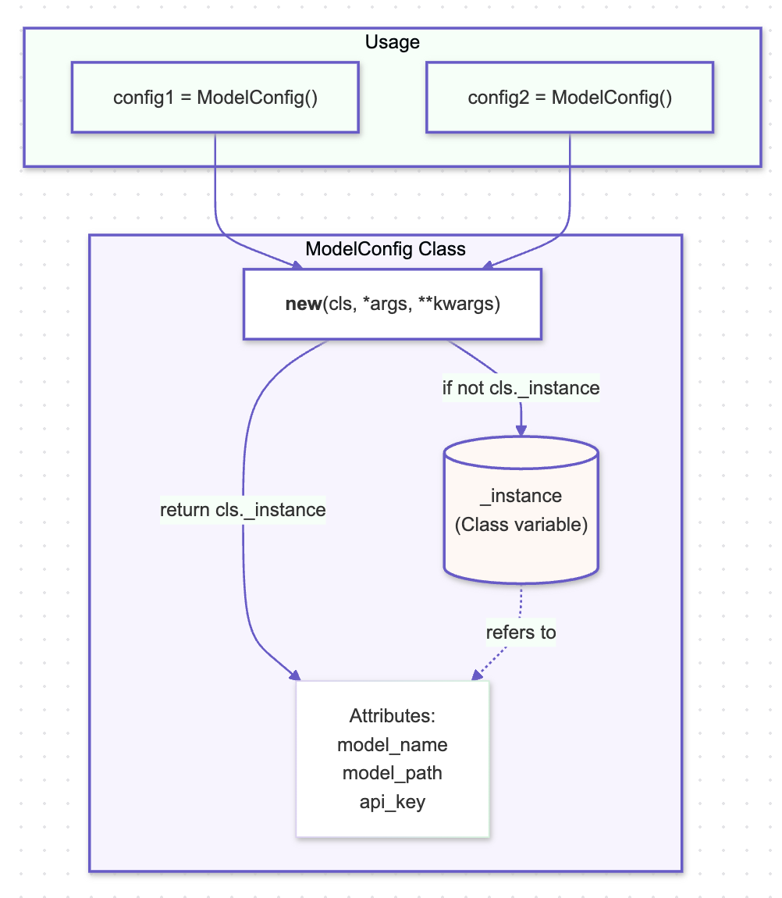

# Singleton Pattern

## Overview

The Singleton Pattern ensures that a class has only one instance and provides a global point of access to that instance. This is particularly useful in AI systems where a single instance of a resource or manager is required to coordinate actions across the system, such as managing shared models, configuration settings, or access to computational resources.

## Benefits

- **Controlled Access to Shared Resources:** In AI systems, Singleton can be used to manage access to shared resources like pre-trained models, ensuring consistent behavior and avoiding the overhead of loading models multiple times.
- **Efficient Resource Management:** By limiting instances, the Singleton pattern helps in managing computational resources efficiently, which is critical in AI environments where GPU memory and CPU cycles are precious.
- **Global Access:** Singleton provides a global access point to key AI components, such as a model inference engine or a data pipeline manager, ensuring that they can be easily utilized across various modules of the application.

## Use Cases

- **Model Management:** A Singleton can manage the lifecycle of AI models, ensuring that only one instance of a model is loaded into memory, reducing the overhead associated with loading and unloading large models.
- **Inference Engine:** A Singleton inference engine can serve as a central point for handling predictions, ensuring consistency and reducing the risk of loading multiple instances of the same model.
- **Configuration Management:** AI systems often require consistent configuration across different components, and a Singleton can ensure that these settings are centrally managed and globally accessible.
- **Resource Pooling:** Singleton can manage pools of resources like GPU clusters, ensuring that the resources are optimally used without the risk of over-provisioning or under-utilization.

## Pattern Illustration

  

