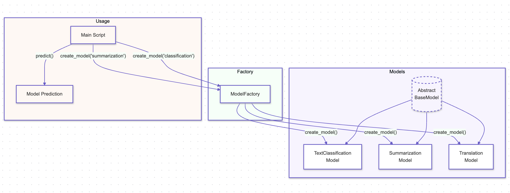

# Factory Pattern

## Overview

The Factory Pattern is a creational design pattern that provides an interface for creating objects in a super class but allows subclasses to alter the type of objects that will be created. This pattern is particularly useful in AI systems where object creation is complex or requires extensive setup, such as configuring different types of models or processing pipelines.

## Benefits

- **Decoupled Object Creation:** The Factory Pattern decouples the object creation process from the code that uses the objects, leading to cleaner, more maintainable code in AI systems where models or components may change frequently.
- **Enhanced Flexibility:** By centralizing the creation logic, the Factory Pattern allows easy swapping or upgrading of AI models, data processors, or other components without modifying the existing codebase.
- **Reusability:** The pattern encourages reusability by providing a standard way to create objects, which can be reused across different parts of an AI system, reducing redundancy and potential errors.

## Use Cases

- **Model Instantiation:** A Factory can be used to instantiate different types of AI models based on the input parameters, allowing for flexible deployment of models tailored to specific tasks.
- **Data Pipeline Creation:** The Factory Pattern can manage the creation of different data processing pipelines, ensuring that the correct series of processors is applied based on the type of input data.
- **Algorithm Selection:** In scenarios where multiple algorithms are available, a Factory can select and instantiate the most appropriate algorithm based on the context, such as choosing between different optimization techniques or learning models.

## Pattern Illustration

  

