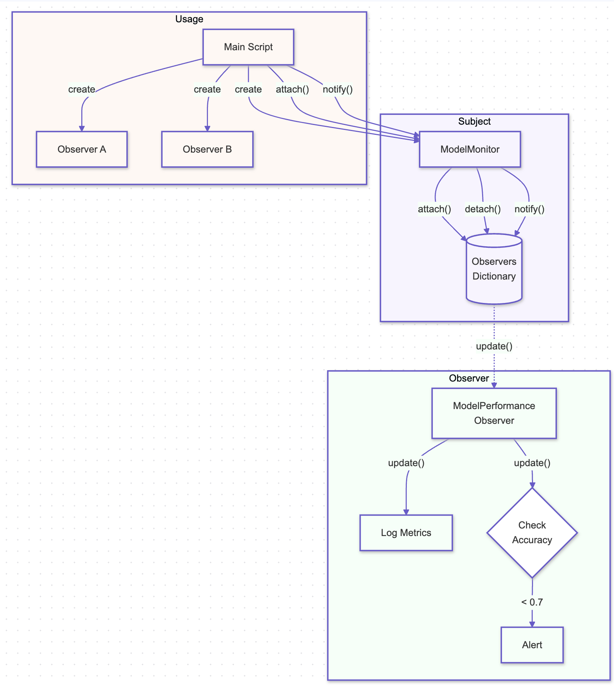

# Observer Pattern

## Overview

The Observer Pattern is a behavioral design pattern that allows an object, known as the subject, to maintain a list of its dependents, called observers, and notify them automatically of any state changes, usually by calling one of their methods. This pattern is particularly useful in AI systems where multiple components need to be updated or informed of changes in state, such as model updates, data changes, or system status.

## Benefits

- **Decoupled Communication:** The Observer Pattern promotes loose coupling between the subject and observers, enabling AI components to interact without being tightly integrated, making the system more modular and easier to maintain.
- **Real-Time Updates:** This pattern is ideal for scenarios where real-time updates are crucial, such as in AI monitoring systems, where changes in input data or model performance need to be propagated instantly across various parts of the system.
- **Scalability:** The Observer Pattern allows adding new observers without modifying the subject, enhancing the scalability of AI systems that may require monitoring or interacting with various components dynamically.

## Use Cases

- **Model Monitoring:** The Observer Pattern can be used to monitor AI model performance, where different monitoring tools (observers) are notified of changes in model metrics, triggering alerts or adjustments.
- **State Synchronization:** In distributed AI systems, the Observer Pattern helps synchronize the state across different nodes or components, ensuring consistency without direct communication between them.
- **Event Handling:** The pattern is effective in event-driven architectures, where various components of an AI system need to respond to specific events, such as data ingestion or model inference completion.

## Pattern Illustration

  

