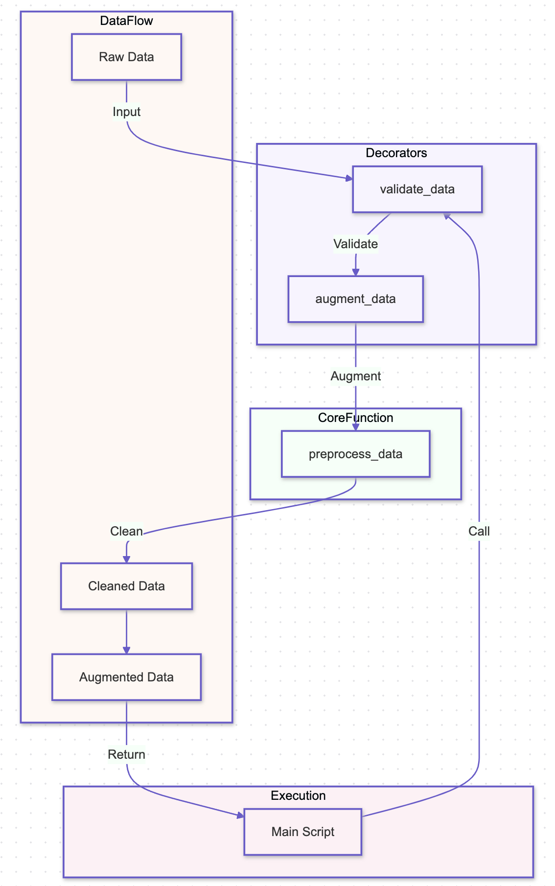

# Decorator Pattern

## Overview

The Decorator Pattern is a structural design pattern that allows behavior to be added to individual objects, either statically or dynamically, without affecting the behavior of other objects from the same class. This pattern is especially useful in AI systems where enhancements or modifications to specific components, such as models or data processors, need to be applied flexibly without altering the original object’s structure.

## Benefits

- **Flexible Enhancements:** The Decorator Pattern enables the dynamic addition of responsibilities to objects, allowing for flexible enhancements in AI systems, such as adding preprocessing steps or logging functionalities to specific models or pipelines.
- **Single Responsibility Principle:** By adhering to the Single Responsibility Principle, the pattern allows each component to handle a specific concern, making the AI system easier to understand, test, and maintain.
- **Reusability and Extensibility:** Decorators can be reused across different objects or components, providing a modular way to extend the functionality of AI models or processors without duplicating code.

## Use Cases

- **Model Preprocessing:** The Decorator Pattern can be used to add preprocessing steps to models, such as scaling, normalization, or data augmentation, without modifying the core model class.
- **Logging and Monitoring:** Decorators can introduce logging and monitoring features into AI components, enabling detailed tracking of model predictions, data processing steps, or system performance metrics.
- **Security and Validation:** In AI systems, decorators can enforce security checks or validate inputs before passing data to the underlying model or processor, ensuring robustness and correctness in operations.

## Pattern Illustration

  

