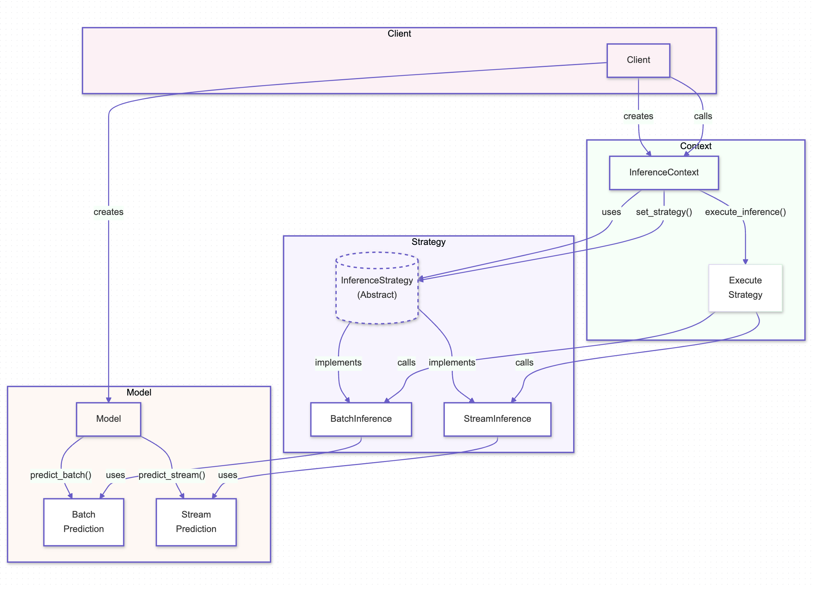

# Strategy Pattern

## Overview

The Strategy Pattern is a behavioral design pattern that defines a family of interchangeable strategies, encapsulates each one, and allows them to be selected dynamically at runtime. This pattern is particularly useful in AI systems where different strategies, such as inference methods, data processing techniques, or even resource management strategies, need to be applied flexibly based on the context or requirements.

## Benefits

- **Flexible Strategy Selection:** The Strategy Pattern enables the dynamic selection of strategies at runtime, offering flexibility in AI systems to adapt to various tasks, data conditions, or environmental factors like network latency and resource availability.
- **Code Reusability:** By encapsulating strategies into separate classes, the pattern promotes reusability across different parts of the system, reducing redundancy and improving overall maintainability.
- **Enhanced Maintainability:** The Strategy Pattern keeps the codebase clean and modular by separating the selection and implementation of strategies, making the system easier to understand, test, and extend.

## Use Cases

- **Inference Methods:** In AI systems, the Strategy Pattern can be used to switch between different inference methods, such as batch inference or stream inference, depending on data size and system constraints.
- **Data Processing Techniques:** The pattern allows for the dynamic selection of data processing techniques, such as normalization, feature extraction, or augmentation, based on specific requirements or data characteristics.
- **Resource Management:** The Strategy Pattern can manage resources like memory and CPU allocation by selecting the most efficient strategy based on current system load and task requirements.

## Pattern Illustration

  

