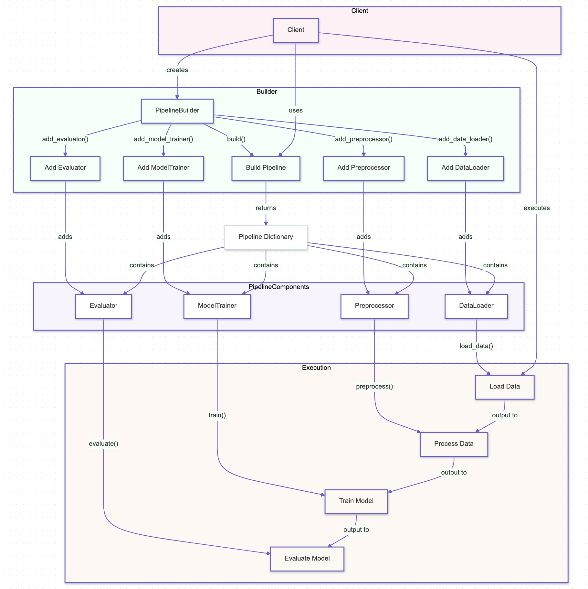

# Builder Pattern

## Overview

The Builder Pattern is a creational design pattern that allows for the construction of complex objects step by step. It separates the construction of an object from its representation, enabling the same construction process to create different representations. This pattern is particularly useful in AI systems where objects like machine learning models, data pipelines, or configuration setups need to be built in a flexible and controlled manner.

## Benefits

- **Controlled Object Construction:** The Builder Pattern allows for precise control over the construction process, ensuring that complex objects like AI models or data pipelines are assembled correctly with all required components.
- **Separation of Concerns:** By separating the construction process from the final product, the Builder Pattern promotes cleaner code and better organization, making it easier to manage and maintain complex systems.
- **Flexibility in Object Creation:** The pattern provides flexibility to create different representations or configurations of an object using the same construction process, which is particularly valuable in AI systems where customization and variations are common.

## Use Cases

- **Machine Learning Model Construction:** The Builder Pattern can be used to build machine learning models with different configurations (e.g., layers, activation functions, optimization techniques) while maintaining a clear and organized construction process.
- **Data Pipeline Setup:** In complex data processing systems, the pattern can help in constructing data pipelines step by step, allowing for variations in data transformation, validation, and storage mechanisms.
- **Configuration Management:** The Builder Pattern can manage configurations for AI systems, enabling the creation of different system setups or environments by assembling various configuration options in a flexible manner.

## Pattern Illustration

  

