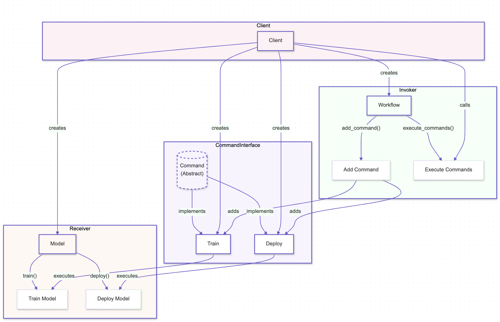

# Command Pattern

## Overview

The Command Pattern is a behavioral design pattern that encapsulates a request as an object, thereby allowing for parameterization of clients with queues, requests, and operations. It also provides the ability to undo/redo operations. This pattern is particularly useful in AI systems where actions need to be executed, queued, or reversed dynamically, such as in task scheduling, model training operations, or workflow automation.

## Benefits

- **Encapsulation of Operations:** The Command Pattern encapsulates operations or requests as objects, making it easier to manage and execute complex actions in AI systems, such as model training or data processing tasks.
- **Undo/Redo Functionality:** The pattern inherently supports undo and redo functionality, which is valuable in scenarios like iterative model training or tuning, where reverting to previous states might be necessary.
- **Decoupling of Sender and Receiver:** The pattern decouples the sender of a request from its receiver, allowing for more flexible and maintainable code, particularly in systems where commands need to be executed in different contexts or on different objects.

## Use Cases

- **Task Scheduling:** The Command Pattern can be used to schedule tasks in an AI system, such as initiating data preprocessing, triggering model training, or running inference jobs, all managed as commands that can be queued, executed, or canceled.
- **Model Training Operations:** In machine learning workflows, the pattern can encapsulate training steps as commands, enabling the easy execution, modification, or reversal of training processes.
- **Workflow Automation:** The Command Pattern can automate workflows in AI systems, where each step of the workflow (e.g., data ingestion, transformation, model deployment) is treated as a command, allowing for dynamic control and sequencing.

## Pattern Illustration

  

