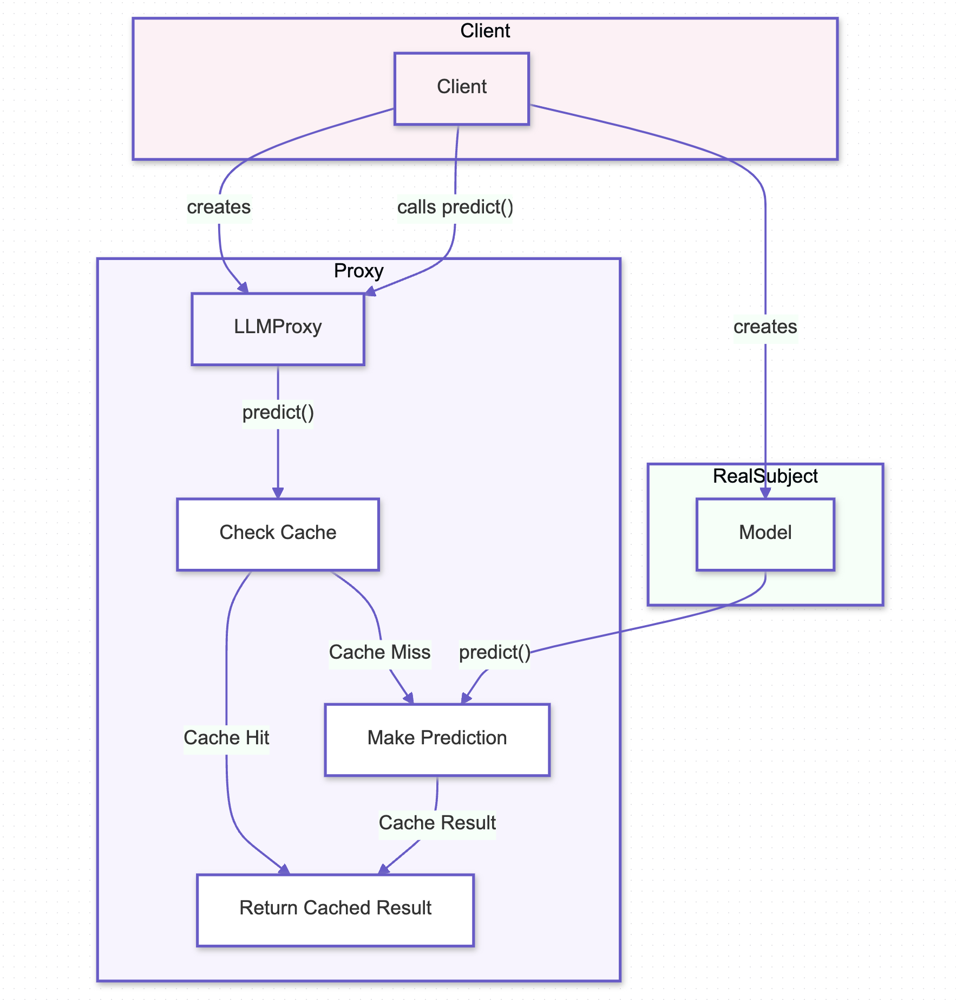

# Proxy Pattern

## Overview

The Proxy Pattern is a structural design pattern that provides a surrogate or placeholder for another object to control access to it. This pattern is particularly useful in AI systems where direct access to an object might be expensive, restricted, or need additional functionality, such as caching, access control, or logging. The Proxy Pattern can help optimize performance and enhance security by managing interactions with resource-intensive AI models.

## Benefits

- **Controlled Access:** The Proxy Pattern allows for controlled access to the underlying AI model, ensuring that only authorized or optimized interactions occur, thereby reducing unnecessary computations and enhancing security.
- **Caching and Performance Optimization:** In AI systems, the Proxy Pattern can implement caching mechanisms to store results of expensive operations, such as model predictions, thereby improving response times for repeated requests.
- **Enhanced Functionality:** The Proxy Pattern enables additional functionality, such as logging or monitoring, to be layered over the original model’s operations without altering the underlying model, promoting modularity and maintainability.

## Use Cases

- **Prediction Caching:** The Proxy Pattern can be used to cache predictions from a language model, avoiding redundant computations for repeated inputs, which is critical in AI systems where latency and computational efficiency are key concerns.
- **Access Control:** Proxies can manage access to AI models, ensuring that only authenticated requests are processed, adding a layer of security in systems where sensitive data or models are involved.
- **Logging and Monitoring:** Proxies can introduce logging and monitoring for interactions with AI models, providing insights into usage patterns and system performance, all without modifying the core model logic.

## Pattern Illustration

  

