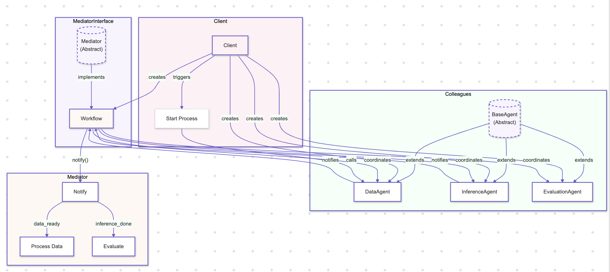
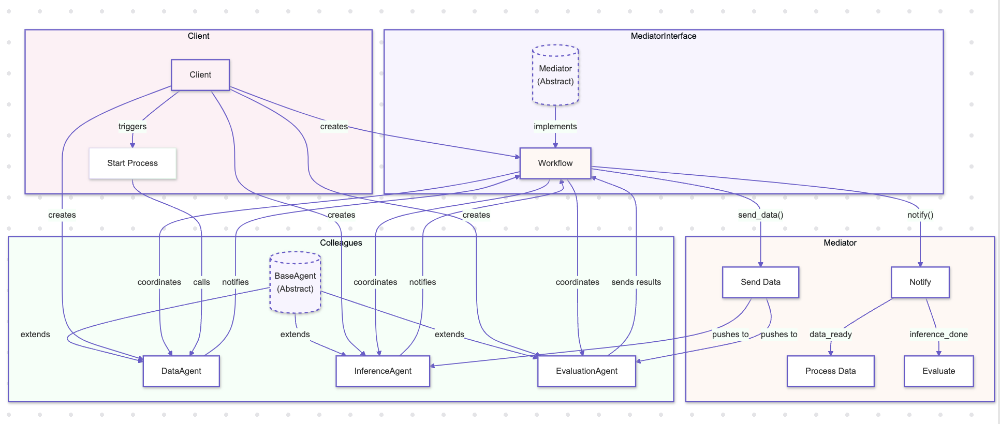

# Mediator Pattern

## Overview

The Mediator Pattern is a behavioral design pattern that defines an object that encapsulates how a set of objects interact. Instead of objects referring to each other directly, they refer to the mediator, which handles the communication between them. This pattern is particularly useful in AI systems where multiple components or services need to interact in a coordinated manner without tightly coupling them.

## Benefits

- **Decoupled Communication:** The Mediator Pattern reduces the dependencies between interacting components by centralizing their communication, making the system more modular and easier to maintain.
- **Simplified Object Interaction:** By using a mediator, the pattern simplifies the interactions between multiple objects, reducing the complexity of the system and making it easier to extend or modify individual components.
- **Enhanced Maintainability:** The centralized control of interactions in the Mediator Pattern makes the system easier to debug, test, and maintain, especially in complex AI systems where many components need to work together seamlessly.

## Use Cases

- **Orchestrating AI Pipelines:** In AI systems, the Mediator Pattern can be used to orchestrate various stages of a machine learning pipeline, such as data preprocessing, model training, and evaluation, ensuring that each stage interacts correctly with the others.
- **Coordinating Distributed Components:** For distributed AI systems, the Mediator Pattern can manage communication between different services, such as data ingestion, processing, and storage, ensuring that each service functions cohesively within the system.
- **Managing User Interactions:** The pattern can be applied to manage user interactions in AI-driven applications, where the mediator coordinates between different UI components, backend services, and AI models to deliver a seamless user experience.

## Pull vs. Push Models

### Pull Model

In the pull model, the components request information from the mediator when they need it. The mediator does not actively send updates; instead, it waits for the components to request the data. The components explicitly request the data or information from the mediator, and the mediator provides the data only when asked.

**When to Use:**
- **On-Demand Data Retrieval:** The pull model is suitable when components need data only occasionally or when it is critical to reduce unnecessary data traffic, such as in batch processing systems or analytics platforms where data is fetched on demand.
- **Resource Optimization:** Use the pull model when system resources need to be conserved, as it reduces the load on the mediator and network by avoiding continuous data pushes.
- **Asynchronous Processing:** In systems where components process data asynchronously, the pull model allows them to fetch data at their own pace, which is useful in scenarios like background data processing or periodic data synchronization.

### Push Model

In the push model, the mediator actively sends updates or messages to the components it manages as soon as the mediator receives or generates new information. The components do not request the data; instead, they receive it automatically from the mediator. The data or message is actively pushed from the mediator to the components, without the components explicitly asking for it.

**When to Use:**
- **Real-Time Systems:** Use the push model in systems where real-time updates are crucial, such as in live data feeds, real-time monitoring, or event-driven architectures where the mediator needs to push updates to components as soon as changes occur.
- **Low-Latency Requirements:** The push model is ideal when low latency is required, as it eliminates the need for components to request data, reducing response times.
- **High-Volume Updates:** In scenarios where components need to react immediately to a high volume of updates, such as in stock trading platforms or sensor networks, the push model ensures timely delivery of information.

## Pattern Illustration

### Pull Model

  

### Push Model

  

