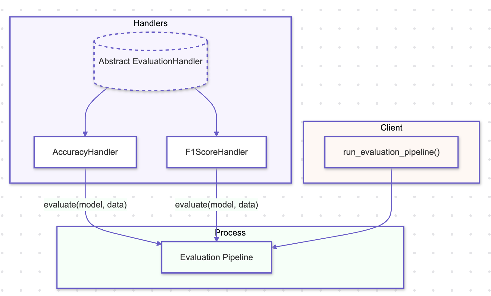

# Chain of Responsibility Pattern

## Overview

The Chain of Responsibility Pattern is a behavioral design pattern that allows a request to be passed along a chain of handlers, where each handler can either process the request or pass it to the next handler in the chain. This pattern is particularly useful in AI systems where multiple processing steps, validations, or operations need to be performed on a model, dataset, or request, with the ability to customize the handling sequence dynamically.

## Benefits

- **Decoupled Processing Steps:** The Chain of Responsibility Pattern decouples the steps or operations in an AI pipeline, allowing each handler to focus on a specific task. This separation makes the pipeline more modular and easier to manage, with the ability to add, remove, or rearrange handlers without impacting the overall flow.
- **Flexible Processing:** The pattern allows for dynamic adjustment of the processing sequence. In AI systems, this flexibility is crucial when applying a series of transformations, validations, or evaluations, where the order or inclusion of steps may change based on context or requirements.
- **Enhanced Reusability:** By encapsulating processing logic within individual handlers, the pattern promotes reusability across different AI workflows. Each handler can be independently developed and tested, making it easy to reuse them in different parts of the system or in entirely different projects.

## Use Cases

- **Data Preprocessing Pipelines:** The Chain of Responsibility Pattern can be used to implement data preprocessing pipelines, where each handler performs a specific transformation, such as normalization, outlier removal, or feature encoding. Handlers can be added or removed based on the data's characteristics or the requirements of the model.
- **Model Validation and Testing:** In AI, this pattern is effective for sequentially applying a series of validation checks or tests on a model before it is deployed. Each handler might perform checks like cross-validation, performance benchmarking, or robustness testing, ensuring the model meets all necessary criteria.
- **Request Handling in AI Systems:** The pattern is well-suited for AI systems that need to handle requests involving multiple steps, such as processing an inference request. Each handler in the chain could perform tasks like input validation, model inference, result post-processing, and logging, with the flexibility to modify the sequence as needed.

## Pattern Illustration

  

